# 基于内核栈的进程切换

## 1. 主要内容

- 编写汇编程序`switch_to`
- 在主体框架下依次完成PCB切换，内核栈切换，LDT切换等
- 修改`fork()`，由于是基于内核栈的切换，所以进程需要创建出能完成内核栈切换的样子
- 修改PCB，即`task_struct`结构，增加相应的内容域，同时处理由于修改了`task_struct`所造成的影响

## 2. 问题

### 2.1 为什么将TSS切换改为内核栈切换

Linux 0.11利用80x86硬件提供的机制：通过执行`ljmp next进程TSS描述符的选择符, (无用的)偏移地址`指令来进行任务切换。

> 现在的Linux 0.11采用TSS和一条指令就能完成任务切换，虽然简单，但这条指令的执行时间却很长，在实现任务切换时需要200多个时钟周期(一个任务的时间片只有15个时钟周期)。而通过堆栈实现任务切换可能要更快，而且采用堆栈的切换还可以使用指令流水的并行优化技术，同时又使得CPU的设计变得简单。所以无论是Linux还是Windows，进程/线程的切换都没有使用Intel提供的这种TSS切换手段，而都是通过堆栈实现的。

+ 对于函数调用，依靠栈进行返回地址保存和弹栈返回操作；

+ 对于用户级线程，每个线程拥有一个线程控制块TCB，TCB关联着用户栈，TCB切换引起用户栈跟着切换，实现从一个线程切换到另一个线程以及再次切换回这个被换出的线程；

+ 对于核心级线程，线程切换发生在内核，从用户态进入内核态首先要发生线程用户栈到内核栈的切换，线程的TCB关联着内核栈，TCB切换引起内核栈切换，利用`iret`指令进行中断返回会引起内核栈中用户态参数的出栈，从而实现执行流程转移到新进程的用户态指令和用户栈。

### 2.2 TSS还有用吗

虽然不再使用`ljmp TSS段选择符的选择子, (不使用的)段内偏移`进行任务切换，但Intel的中断处理机制仍需要保持，因为CPU正是依靠这种机制才能在中断处理时找到内核栈，并将用户态下的`SS:ESP, EFLAGS, CS:EIP`这5个寄存器的值自动压入到内核栈中，这是沟通用户栈(用户态)和内核栈(内核态)的关键桥梁。

所以仍然需要有一个当前TSS，这个TSS就是需要我们额外定义的全局变量tss，即0号进程的tss，所有进程都共用这个tss，任务切换时不再发生变化。

### 2.3 中断和异常的硬件处理

特权级发生变化时，也就是说，当前特权级CPL(存放在CS寄存器的低两位)不同于所选择的段描述符的DPL(从GDT表中获取的段描述符中的描述符特权级DPL)，控制单元必须开始使用与新的特权级相关的栈，要发生栈的切换。通过执行以下步骤来做到这点：

1. 读`TR`寄存器，里面保存了`TSS`段的选择子，利用该选择子在GDT表中找到运行进程的TSS段的内存位置。
2. 在`TSS`段中找到新特权级相关的栈段和栈指针即`ss0`和`esp0`，将它们装载到`ss`和`esp`寄存器。
3. 在新的栈中保存`ss`和`esp`以前的值，这些值定义了旧特权级相关的栈的逻辑地址。形象点说，就是在新栈和旧栈之间拉了一条线，形成了一套栈。
4. 如果故障已发生，用引起异常的指令地址装载`cs`和`eip`寄存器，从而使得这条指令能再次执行。
5. 在栈中保存`eflags`,`cs`,`eip`的内容。
6. 装载`cs`和`eip`寄存器，其值分别是IDT表中由中断号指定的门描述符的段选择符和偏移量字段。这些值给出了中断或异常处理程序的第一条指令的逻辑地址。

而在中断或异常处理完毕后，相应的处理程序必须产生一条`iret`指令，把控制权转交给被中断的进程，这将迫使控制单元：

1. 用保存在栈中的值装载`cs`,`eip`和`eflags`寄存器。如果一个硬件出错码曾被压入栈中，并且在`eip`内容的下面，那么，在执行`iret`指令前必须先弹出这个硬件出错码。
2. 检查处理程序的CPL是否等于`cs`中最低两位的值(这意味着被中断的进程与处理程序运行在同一特权级)。如果是，`iret`终止执行；否则，转入下一步。
3. 从栈中装载`ss`和`esp`寄存器，因此，返回到与旧特权级相关的栈。
4. 检查`ds`,`es`,`fs`及`gs`段寄存器的内容，如果其中一个寄存器包含的选择符是一个段选择符，并且其DPL的值小于`CPL`，那么，清相应的段寄存器。控制单元这么做是为了禁止用户态的程序(CPL=3)利用内核以前所用的段寄存器(DPL=0)。如果不清这些寄存器，怀有恶意的用户态程序就可能利用它们来访问内核地址空间。

## 3. 进程切换的五段论

### 3.1  利用中断进入内核引起用户栈到内核栈的切换

**利用中断进入内核时CPU通过TR寄存器找到TSS的内存位置，利用里面的`ss0`和`esp0`的值设置好内核栈(此时内核栈是空的，esp0应该设置为内核栈的栈顶地址)，将用户栈的`ss`和`esp`的值压入到内核栈，建立起了用户栈和内核栈的联系，形象点说，即在用户栈和内核栈之间拉了一条线，形成了一套栈。同时将用户态的`eflags`,`cs`,`eip`的值也压入到内核栈，保存用户态程序的返回地址。将由中断号指定的IDT表中门描述符的段选择符和偏移量字段装载到`cs`和`eip`寄存器，所以将跳转到中断或异常处理程序的第一条指令执行，对系统调用而言就是`system_call`中断处理程序**。

`system_call`接着将`ds`,`es`,`fs`这3个数据段寄存器，以及保存了系统调用参数的`edx`,`ecx`,`ebx`压栈，开始执行相应的系统调用。由于改写后的`fork`系统调用，要创建出新建进程能够完成切换的内核栈的样子，所以我们这里就以`fork`系统调用入手看一下后续的父进程的内核栈变化。

根据`eax`中保存的系统调用号`__NR_fork`的值，在`sys_call_table`数组中找到`fork`的内核实现函数`sys_fork`，并从`system_call`跳转到`sys_fork`执行，这个过程会将`system_call`的下一条指令的地址压栈。

`sys_fork`先调用`find_empty_process`为新建进程找到pid，它的值保存在变量`last_pid`中。最终返回新建进程在`task`数组中的下标`nr`。

返回到`sys_fork`后，它又将寄存器`gs`,`esi`,`edi`,`ebp`的值压栈，再将`find_empty_process`的返回值`nr`压栈，并跳转到`copy_process`执行，这个过程中又将`sys_fork`的下一条指令的地址压栈。所以刚进入到`copy_process`后内核栈的样子如下图所示：

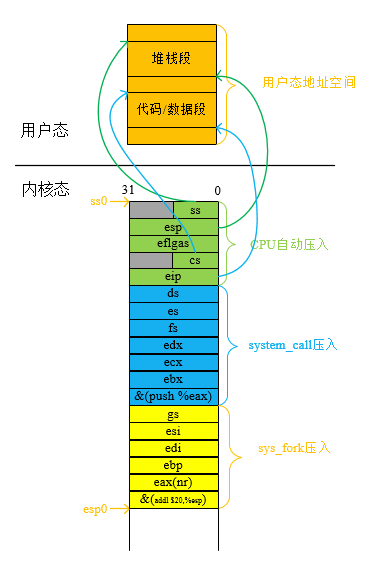 

`copy_process`是`fork`系统调用的核心实现函数，对`fork`的修改就是在其中加入子进程的内核栈的初始化。

### 3.2 引发调度时通过内核栈找到PCB

Linux 0.11把两个不同的数据结构紧凑地存放在一个单独为进程分配的一页内存中：一个是进程描述符PCB，另一个是进程的内核态堆栈。C语言使用下列的联合结构方便地表示一个进程的PCB和内核栈：

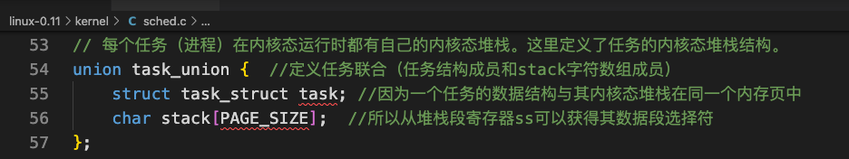 

其中PCB位于这页内存的低地址，栈位于这页内存的高地址从末端向下增长。另外，当前进程的PCB由全局变量`current`指向。

当`sys_fork`返回到`system_call`之后，它首先将`sys_fork`的返回值即`last_pid`压栈，然后判断当前进程`current`是否需要调度。

如果需要调度，则先将`ret_from_sys_call`函数的地址压栈，然后执行`schedule`调度函数。而在`schedule()`函数的末尾的`}`，相当于`ret`指令，会将`ret_from_sys_call`函数的地址作为返回地址出栈，所以`schedule`函数返回到`ret_from_sys_call`函数执行，而该函数是一段包含了`iret`指令的代码。

所以在`system_call`跳转到`schedule`函数执行时的内核栈样子如下：

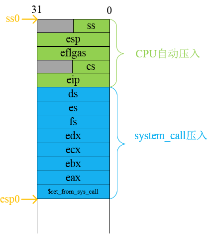 

### 3.3 找到下一个进程的PCB完成PCB的切换

`schedule()`函数通过下面的代码找到下一个进程的PCB：

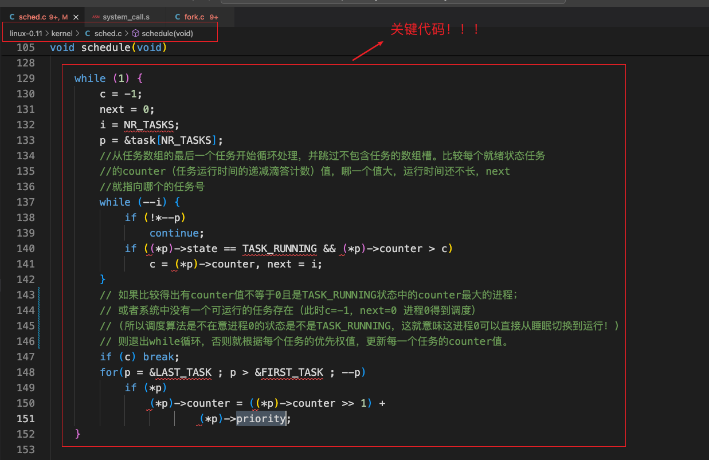 

`next`就是下一个进程在`task`数组中的下标，利用`next`我们就可以找到下一个进程。

在这里我们需要新定义一个PCB结构体的指针变量`pnext`来指向下一个进程，其初始值为进程0的PCB地址`&(init_task.task)`，取这个值是为了保证在系统无事可做时，进程0会得到调度。

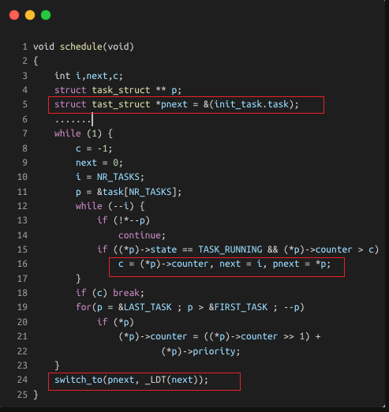 

### 3.4 通过PCB找到内核栈完成内核栈的切换

在进行内核栈切换之前，我们首先对所有进程公用的TSS中的内核栈指针进行重写，将其中表示栈顶指针的`esp0`的值设置为`pnext`的内核栈为空时的栈顶位置，因为从用户态进入内核时内核栈一定是空的。而这个所有进程公用的TSS是一个需要我们新定义的全局变量，和`current`类似：

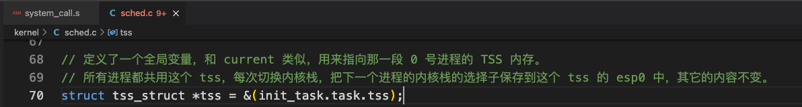 

将其初始化为指向进程0的PCB中的TSS结构体成员。由于内核栈的段寄存器`ss0`的值已经在定义`INIT_TASK`宏变量时设置过，其始终是内核数据段的值`0x10`，所以后续在进行TSS中的内核栈重写时不需要改变。

内核栈的切换：

+ 将寄存器esp(内核栈使用到当前情况时的栈顶位置)的值保存到当前PCB中，再从下一个PCB中的对应位置上取出保存的内核栈栈顶放入esp寄存器，这样处理完毕以后，再使用内核栈时使用的就是下一个进程的内核栈了。

+ 由于进程的地址空间是隔离的，所以需要切换局部描述符表LDT。而新进程的LDT就是`switch_to`函数的第二个参数。
  指令`movl 12(%ebp), %ecx`负责取出对应`_LDT(next)`的那个参数，指令`lldt %cx`负责修改LDTR寄存器，一旦修改完毕，下一个进程再执行用户态程序时使用的映射表就是自己的LDT表了，地址空间实现了分离。
+ 在切换完LDT后还需要执行额外的两句指令`movl $0x17, %ecx mov %cx, %fs`，这两句代码的含义是重新取一下段寄存器fs的值。这两句话必须要加，也必须要出现在切换完LDT之后，这是因为通过fs可以访问进程的用户态内存，LDT切换完成就意味着切换了分配给进程的用户态内存地址空间，所以前一个fs指向的是上一个进程的用户态内存，而现在需要执行下一个进程的用户态内存，所以就需要用这两条指令来重取fs。不过，细心的读者可能会发现：fs是一个选择子，即fs是一个指向描述符表项的指针，这个描述符才是指向实际的用户态内存的指针，所以上一个进程和下一个进程的fs实际上都是0x17，真正找到不同的用户态内存是因为两个进程查的LDT表不一样，所以这样重置一下fs=0x17有用吗，有什么用？**这是因为段寄存器包含两个部分：显式部分和隐式部分。段寄存器的隐式部分保存了显式部分所对应的描述符的基地址和段限长，这样如果不是第一个执行含有段寄存器的指令，那么就不需要进行查表，而是直接使用其隐藏部分中的基地址和段限长，提高了执行指令的效率。所以重新取一下fs的值，是为了刷新fs寄存器的隐式部分的内容，使其变为新进程的基地址和段限长。**

### 3.5 通过内核栈找到用户栈利用iret中断返回到用户态程序和用户栈

我们知道`switch_to`函数的最后一条指令是`ret`，执行该指令将返回到下一个进程(目标进程)的`schedule()`函数的末尾，遇到`}`。

根据在`system_call`跳转到`schedule`函数执行时的内核栈的样子，该`}`相当于`ret`指令将弹出`ret_from_sys_call`的地址，所以将跳转到`ret_from_sys_call`继续执行，它在进行一些信号处理工作后，将一些参数弹栈，最后执行`iret`指令切换到目标进程的用户态程序去执行，用户栈也跟着切换了过去。

## 4. 构造出新建进程能进行切换的内核栈的样子

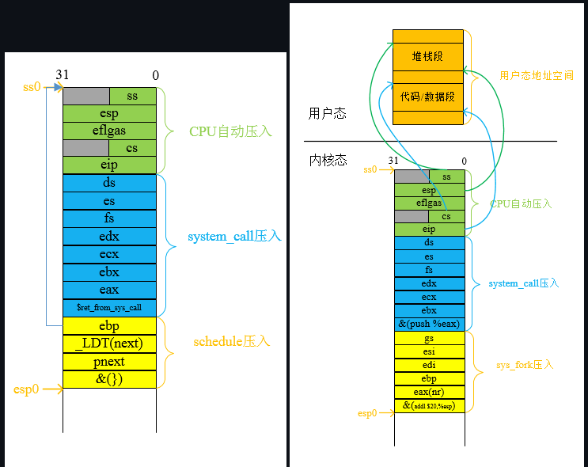 

左图给出的`switch_to`内核栈中有由`schedule`建立的自己的函数调用堆栈框架，即在栈中压入`system_call`的堆栈基值`ebp`(也就是内核堆栈段寄存器`ss0`的值)。

对于父进程来说，从`switch_to`返回到`schedule`，再返回到`ret_from_sys_call`，从而回到用户态，这个前面已经分析过了。

而子进程的内核栈构造必须保证新建进程的除了`eax`寄存器(存放`frok`的“返回值”)外，其他的寄存器都恢复到和父进程一样的值(通过pol对应的寄存器实现)，这样才能保证父子进程的状态一样。

### 4.1 子进程的内核栈构造方法一

由于`switch_to`中会将`ebp`,`eax`,`ebx`,`ecx`的值压栈，所以此处需要设置好这4个寄存器的值。那么根据右图给出的父进程内核栈的内容，容易得出子进程内核栈的样子：

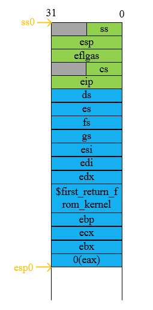 

### 4.2 子进程的内核栈构造方法二

由于父进程的内核栈中已经有`ebp`,`eax`,`ebx`,`ecx`的值，而`switch_to`中又要重新压入，但是为了公用父进程的`ret_from_sys_call`返回函数，子进程的内核栈中要两次设置这4个寄存器的值。这种方式下子进程内核栈的样子：

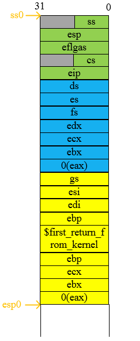 

而此时`first_return_from_kernel`的代码如下：

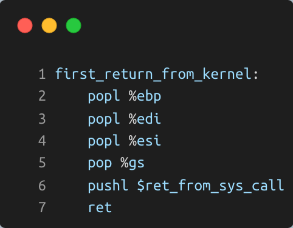 

## 5. 函数调用栈

+ `pushl %eax`

```assembly
subl $4, %esp
movl %eax, (%esp)
```

+ `popl %eax`

```assembly
movl (%esp), %eax
addl $4, %esp
```

+ `call 0x12345`

```assembly
pushl %eip(*)
movl $0x12345, %eip(*)	# (*) 表示只是等效，无法替换为该代码
```

+ `ret`

```assembly
popl %eip(*)
```

+ `enter`

```assembly
pushl %ebp
movl %esp, %ebp
```

+ `leave`

```assembly
movl %ebp, %esp
popl %ebp
```

### 5.1 由调用者进行函数参数压栈以及返回地址压栈

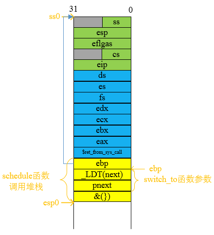 

可以看出，函数参数是逆序压入的。这么做的原因是为了解决实际传递的参数数量和被调函数期望接受的参数数量不同的问题。假如顺序压入参数，第1个参数距离被调函数的栈帧指针(`ebp`，属于被调函数的函数调用堆栈)的偏移量就和压入到堆栈的参数数量有关。

编译器可以计算出这个值，但还是存在问题——实际传递的参数数量和函数期望接受的参数数量可能并不相同(回想下`exec`系列系统调用中`execl`,`execlp`,`execle`这3个都是可变参数函数，其都是基于`execve`系统调用的C语言库中封装的函数。`execve`系统调用的参数只有3个，而这3个函数的参数个数不受限制)。在这种情况下，这个偏移量就是不正确的，当函数试图访问一个参数时，它实际所访问的将不是它想要的那个。

### 5.2 由被调用函数建立自己的函数调用框架

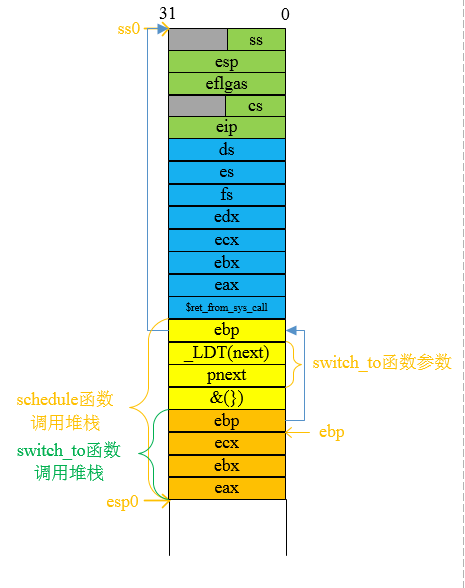 

`switch_to`一上来先执行`pushl %ebp movl %esp, %ebp`建立自己的函数调用框架。

### 5.3 由被调用函数在返回前拆除自己的函数调用框架

`switch_to`在执行`ret`指令前通过`popl %eax popl %ebx popl %ecx popl %ebp`拆除自己的函数调用框架。

### 5.4 由调用者进行函数参数的弹出操作

`schedule`是C函数，会自动处理函数调用框架。最后的`}`，会拆除函数调用框架。

## 6. 最后的补充

### 6.1 Linux内核使用描述符表的示意图

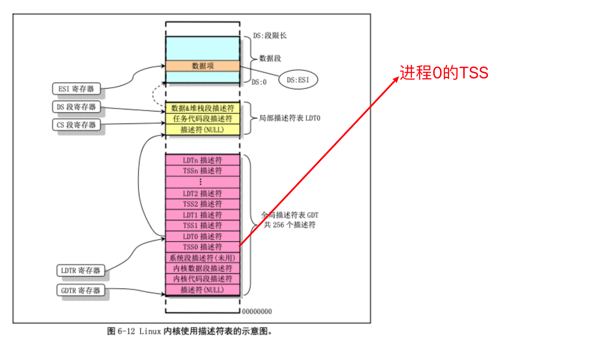 

### 6.2 内核栈内容在进程切换时的变化过程

 

### 6.3 fork进程的父子进程结构

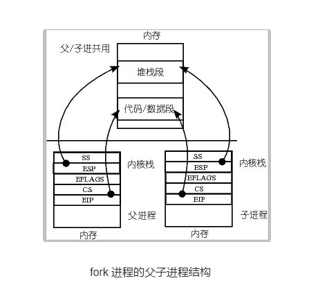 

## 7. Begin

### 7.1 修改linux-0.11/kernel/sched.c

增加语句：

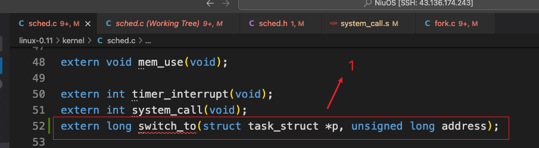 

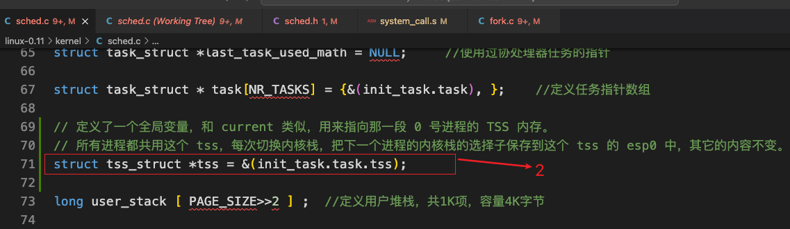 

修改函数：

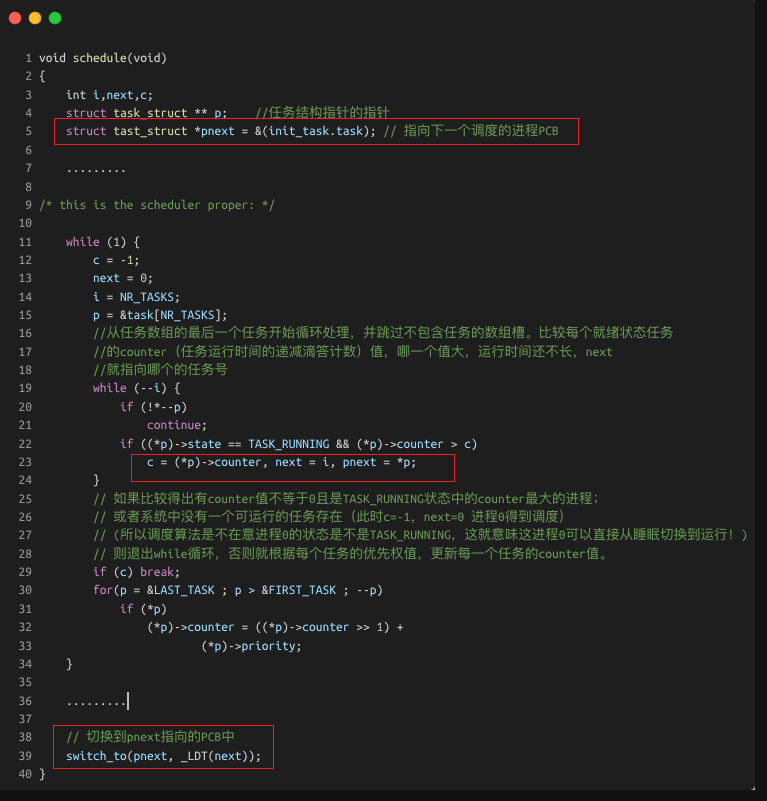 

### 7.2 修改linux-0.11/include/linux/sched.h

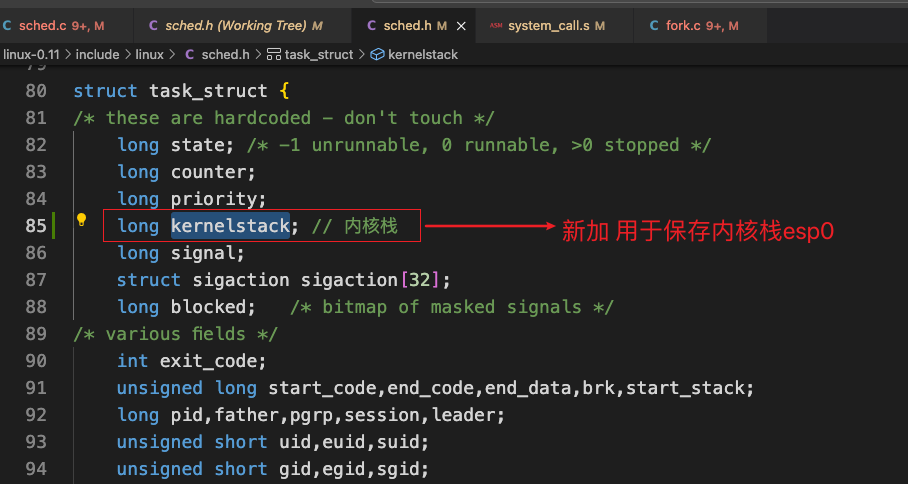 

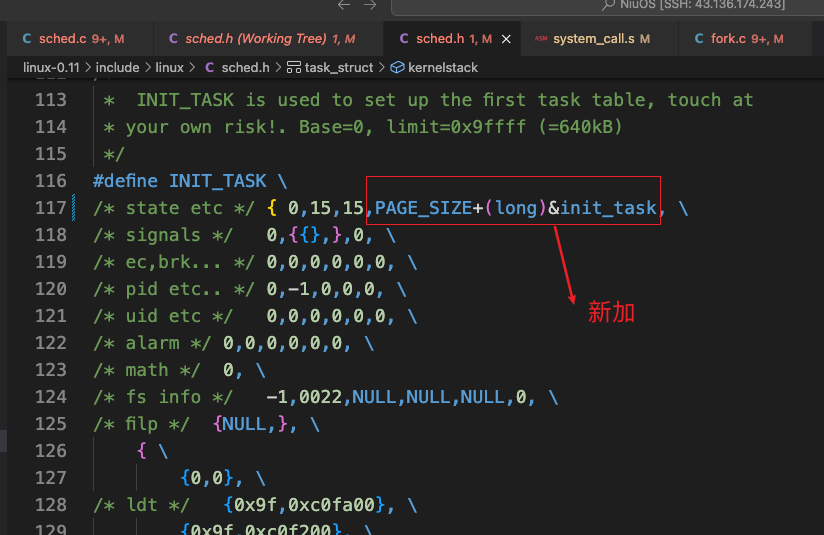 

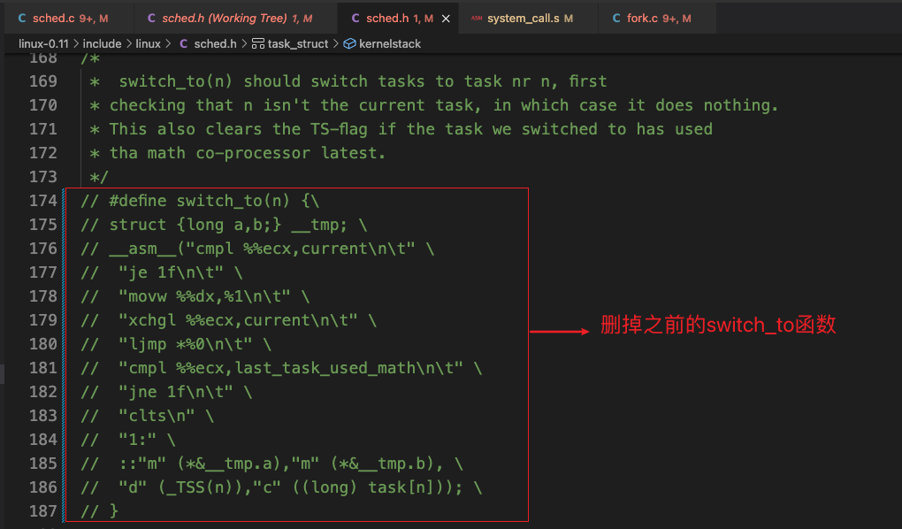 

### 7.3 修改linux-0.11/kernel/system_call.s

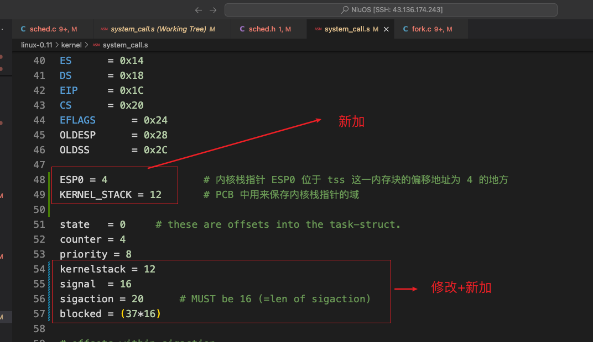 

新加函数（加在文件最后面）：

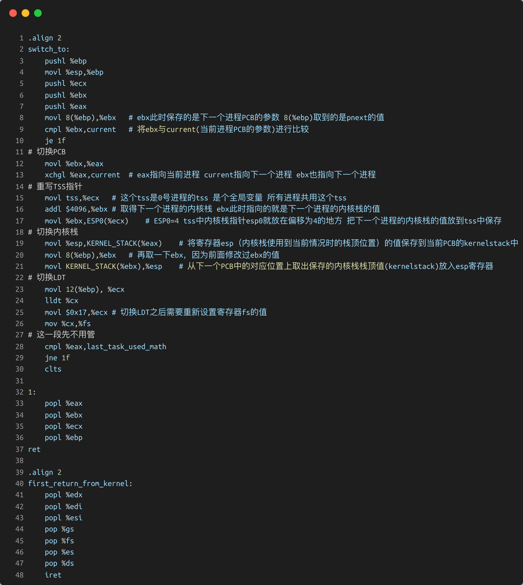 

### 7.4 修改linux-0.11/kernel/fork.c

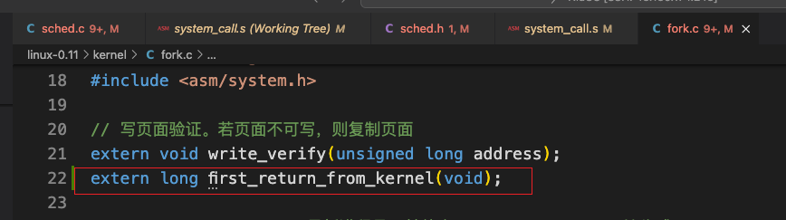 

修改函数：

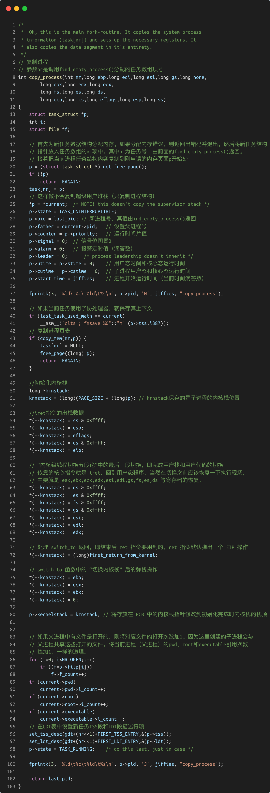 


