# 实现信号量解决生产者消费者问题

## 1. 理论知识

### 1.1 sleep_on的实现

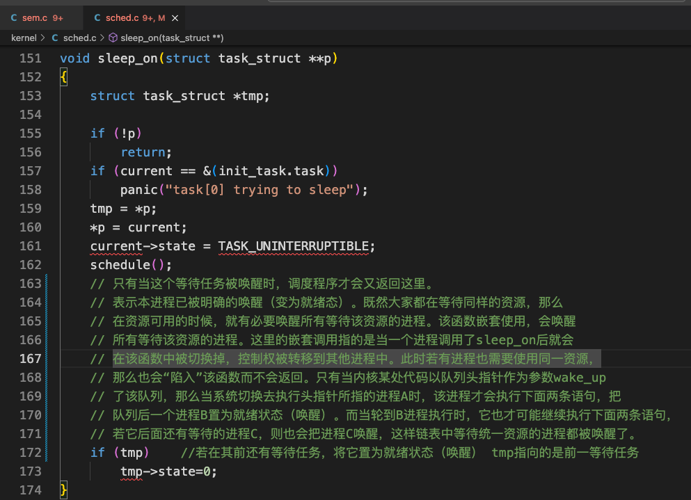 

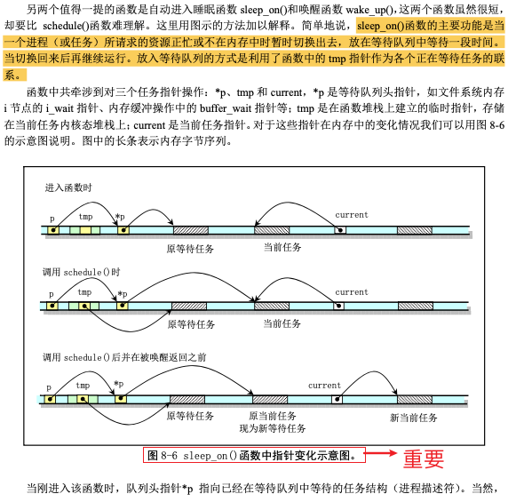 

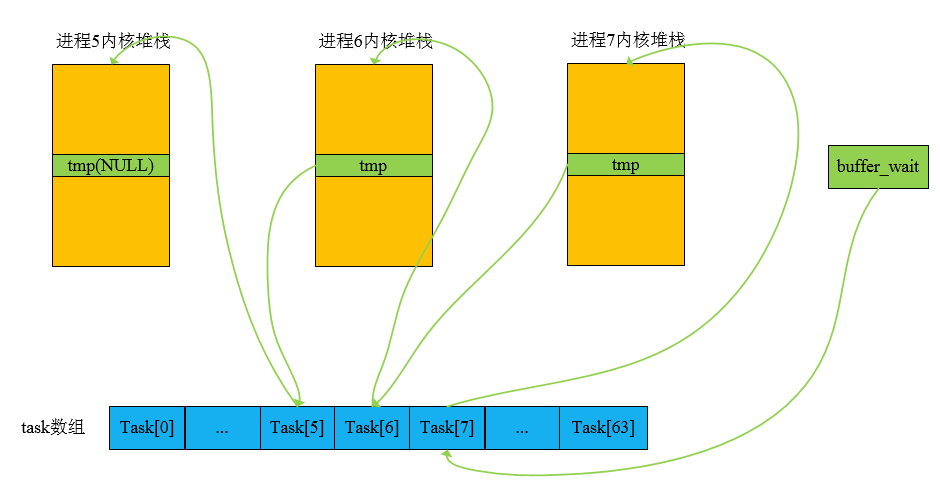 

假设`*p`现在就是buffer_wait，我们现在正在进程8中运行，此时有资源满足buffer_wait的条件了，则在进程8中调用wake_up去唤醒buffer_wait中的进程。

+ 首先被唤醒就是进程7，它变为就绪，得到时间片运行后它会去检查它之后还有没有等待进程，找到进程6，然后将进程6唤醒。

+ 进程6得到时间片运行后它会去检查它之后还有没有等待进程，找到进程5，将进程5唤醒。
+ 进程5得到时间片运行的时候，它也去检查它之后还有没有等待进程，没有，则直接返回了。

至此，所有等待同一资源的进程都被唤醒了。

### 1.2 wake_up的实现

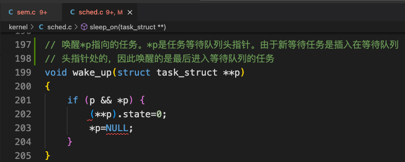 

## 2. 关键代码

### 2.1 sem_wait

#### 2.1.1 正确代码

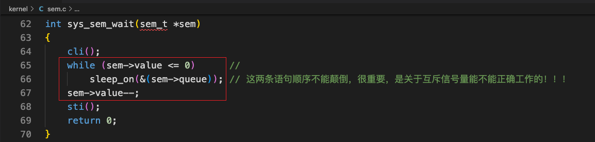 

#### 2.1.2 错误修改一

可不可以改为：

```c
if (sem->value < 0)
    sleep_on(&(sem->queue));
```

结论：不行。

`sleep_on`会形成一个隐式的链表，而`wake_up`只要唤醒来的等待队列的头结点，就可以依靠sleep_on内部的判断语句：

```c
if (tmp)
    tmp->state = 0;
```

实现依次唤醒全部等待的进程。

假如我们这样实现了：

```c
if (sem->value < 0)
    sleep_on(&(sem->queue));
```

现在sem=-1，生产者往缓冲区写入了一个数，sem=0<=0，此时应该将等待队列队首的进程唤醒。

当被唤醒的队首进程再次调度执行，从`sleep_on()`函数退出，不会再执行此if判断，而直接从if语句退出，继续向下执行。

而等待队列后面被唤醒的进程随后也会被调度执行，同样也不会执行if判断，退出if语句，继续向下执行，这显然是不应该的。

因为生产者只往缓冲区写入了一个数，被等待队列的队首进程取走了，由于等待队列的队首进程已经取走了那个数，它应该已经将sem修改为sem=-1，其他等待的进程应该再次执行if判断，由于sem=-1<0，会继续睡眠。

要让其他等待进程再次执行时，要重新进行判断，所以不能是if语句了，必须是下面的while语句：

```c
while (sem->value < 0)
    sleep_on(&(sem->queue));
```

#### 2.1.3 错误修改二

```c
int sys_sem_wait(sem_t *sem)
{
    cli();
    sem->value--;
    while( sem->value < 0 )
	    sleep_on(&(sem->queue))
    sti();
    return 0;
}
```

上面这代码有问题吗？让我们举个反例来看看。

这么做的问题在于：假如当前有两个消费者因为缓冲区为空而阻塞，此时`sem->value = -2`。

接着生产者往空缓冲区放入了一个数字，执行`sem_post`操作，将`value`值加1,此时`sem->value = -2+1 = -1 <= 0`，唤醒队首进程。

队首进程从`sleep_on`函数退出，进入`while (sem->value < 0)`的判断，由于此时还有一个消费者阻塞，所以`sem->value = -1`，这就导致该队首进程又被阻塞，明明现在缓冲区有一个数可取，但之前阻塞的两个消费者仍是阻塞，不能取数。

出错的原因在于：信号量减1的语句，要放在while判断后面，因为执行while判断时，进程有可能睡眠，而这种情况下，是不需要记录有多少个进程在睡眠的，因为`sleep_on`函数形成的隐式的等待队列已经记录下了进程的等待情况。
正确的`sem_wait()`代码如下：

```c
int sys_sem_wait(sem_t *sem)
{
    cli();
    while (sem->value <= 0)      //
        sleep_on(&(sem->queue)); // 这两条语句顺序不能颠倒，很重要，是关于互斥信号量能不能正确工作的！！！
    sem->value--;
    sti();
    return 0;
}
```

现在假设sem=0，然后此时消费者1进来，0<=0，消费者1睡眠；此时消费者2进来，0<=0，消费者2也睡眠；此刻睡眠了两个进程。

过了一段时间，生产者生产了一个资源sem=1，生产者进程用wake_up唤醒等待队列：

```
消费者2--->消费者1
```

消费者2和消费者1都被唤醒了（就绪）。

+ 一段时间后消费者2得到时间片运行，消费了之后，将sem减1，sem变为0。

+ 一段时间后消费者1得到时间片运行，但是它指向while循环的时候发现0<=0，又会继续睡眠。因为消费者2已经消费完了资源，虽然消费者1就绪了，但是资源已经被消费完了，所以还是得继续等待。

### 2.2 sem_post

`sem_post`的实现必须结合`sem_wait`的实现分析。

假设当前缓冲区为空，没有数可取，`sem->value = 0`。

消费者1执行`sem_wait`，由于信号量减1的指令在while判断后面，此时`value = 0`，消费者1阻塞。

消费者2执行`sem_wait`，同样`value = 0`，消费者2阻塞。

生产者执行`sem_post`，信号量的值加1，此时`value = 1`，要唤醒等待队列的队首进程消费者1。所以`sem_post`中的if判断应该为：

```c
if (sem->value <= 1)
    wake_up(&(sem->queue));
```

消费者1执行，唤醒消费者2，跳出while判断，将信号量的值减1，此时`value = 0`。消费者1继续向下执行。

如果消费者2接着执行，由于之前生产者放入到缓冲区的唯一一个数已经被消费者1取走，所以此时`value = 0`，消费者2执行while判断，不满足条件，重新阻塞。

由此得到，`sem_post`中唤醒进程的判断条件为：`sem->value <= 1`。

`sem_post`实现如下：

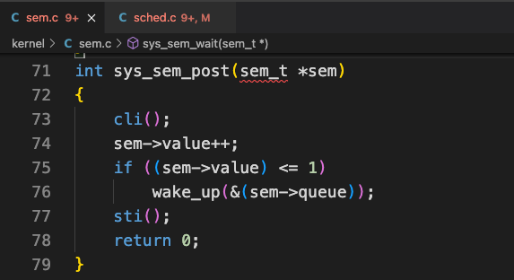 

## 3. 代码修改

### 3.1 新建linux-0.11/include/linux/sem.h

信号量的头文件：

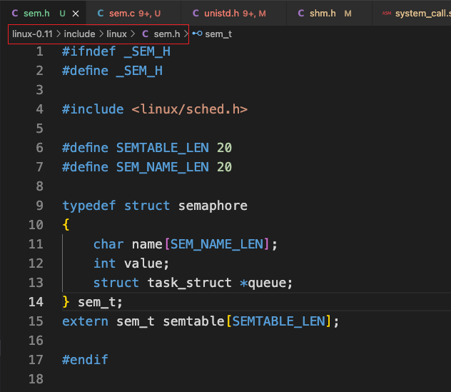 

### 3.2 新建linux-0.11/kernel/sem.c

信号量的实现：

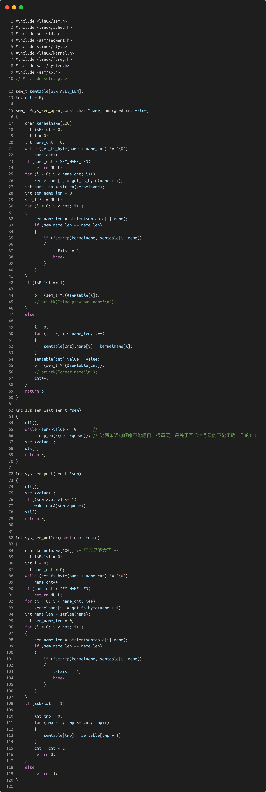 

### 3.3 修改linux-0.11/include/unistd.h

添加信号量实现的系统调用号：

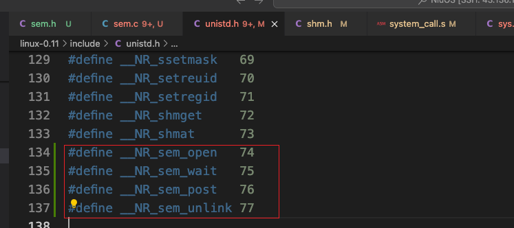 

### 3.4 修改linux-0.11/kernel/system_call.s

修改总的系统调用个数：

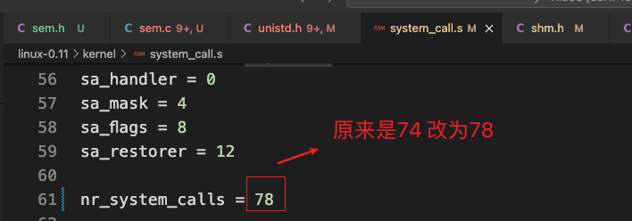 

### 3.5 修改linux-0.11/include/linux/sys.h

往系统调用表添加声明：

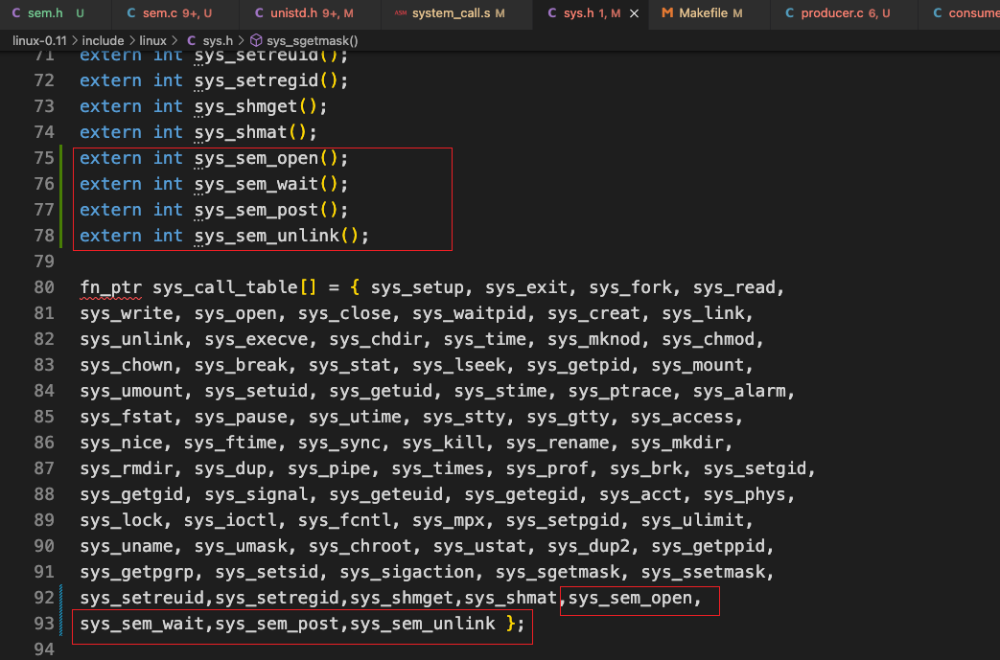 

### 3.6 修改linux-0.11/kernel/Makefile

在makefile中加入信号量代码：

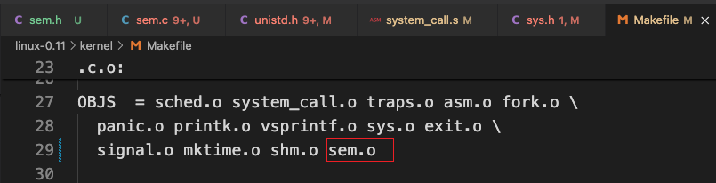 

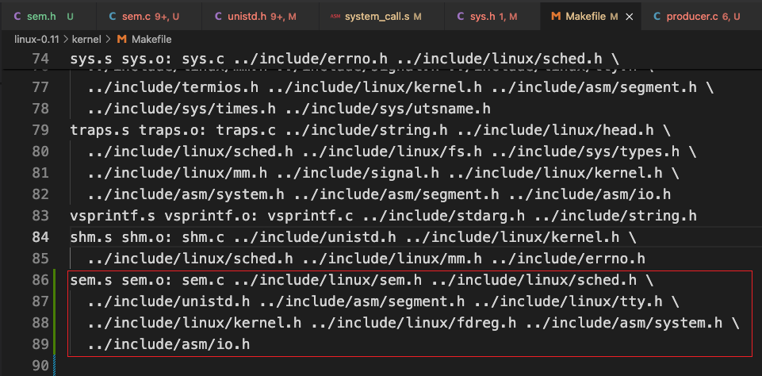 

## 4. 测试程序

### 4.1 test/test_pc/producer.c

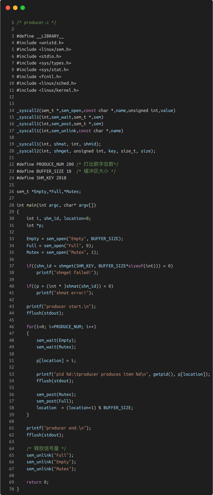 

### 4.2 test/test_pc/consumer.c

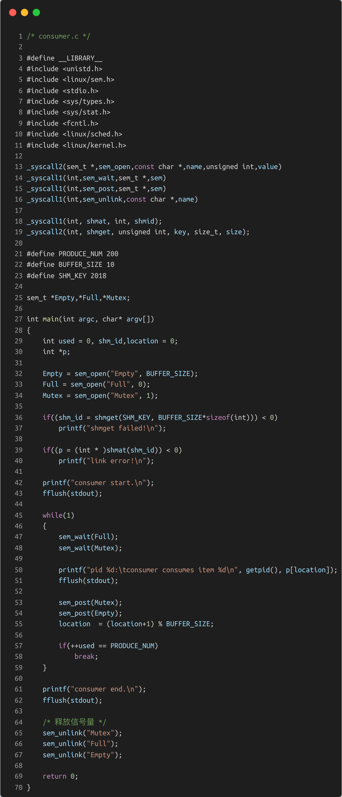 

## 5. 结果

```bash
ubuntu@VM-0-16-ubuntu:~/GithubFile/NiuOS$ sudo ./mount-hdc 

ubuntu@VM-0-16-ubuntu:~/GithubFile/NiuOS$ cp ./linux-0.11/include/unistd.h ./hdc/usr/include/

ubuntu@VM-0-16-ubuntu:~/GithubFile/NiuOS$ cp ./linux-0.11/include/linux/sem.h ./hdc/usr/include/linux/sem.h

ubuntu@VM-0-16-ubuntu:~/GithubFile/NiuOS$ sudo umount hdc
```

+ 将test/test_pc/producer.c和test/test_pc/consumer.c拷贝到/hdc/usr/root中编译运行
+ 收获结果
