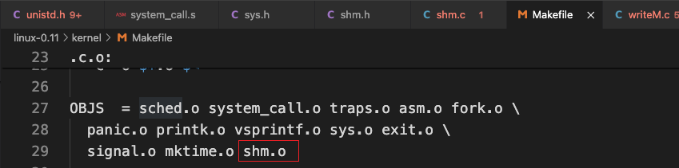

# 实现共享内存

## 1. 修改linux-0.11/include/unistd.h

 

## 2. 修改linux-0.11/kernel/system_call.s

 

## 3. 修改linux-0.11/include/linux/sys.h

 

## 4. 新建linux-0.11/include/shm.h

 

## 5. 新建linux-0.11/kernel/shm.c

 

##  6. 修改linux-0.11/kernel/Makefile

 

 

## 7. 测试程序

### 7.1 test/test_shared_memory/writeM.c

 

### 7.2 test/test_shared_memory/readM.c

 

## 8. 最后的准备

```bash
ubuntu@VM-0-16-ubuntu:~/GithubFile/NiuOS$ sudo ./mount-hdc 

ubuntu@VM-0-16-ubuntu:~/GithubFile/NiuOS$ cp ./linux-0.11/include/unistd.h ./hdc/usr/include/

ubuntu@VM-0-16-ubuntu:~/GithubFile/NiuOS$ cp ./linux-0.11/include/shm.h ./hdc/usr/include/

ubuntu@VM-0-16-ubuntu:~/GithubFile/NiuOS$ cp -r ./test/test_shared_memory/. ./hdc/usr/root/

ubuntu@VM-0-16-ubuntu:~/GithubFile/NiuOS$ sudo umount hdc
```

## 9. 出结果

 

 


