# 进程运行状态分析

## 1. 开始

### 1.1 进程状态变化图

 

### 1.2 测试程序

地址：test/test_process_state/process.c

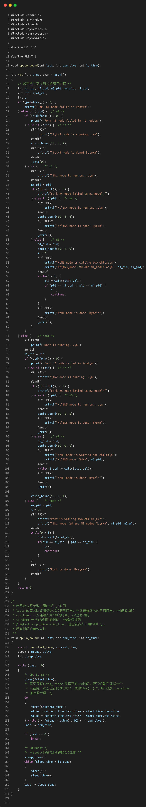 

### 1.3 创建log文件

文件：linux-0.11/init/main.c

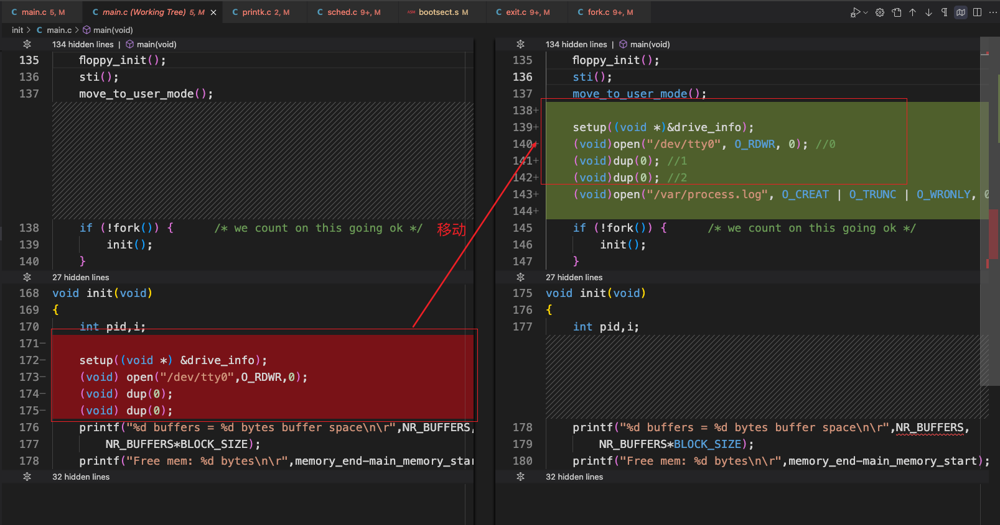 

### 1.4 写log文件

文件：linux-0.11/kernel/printk.c

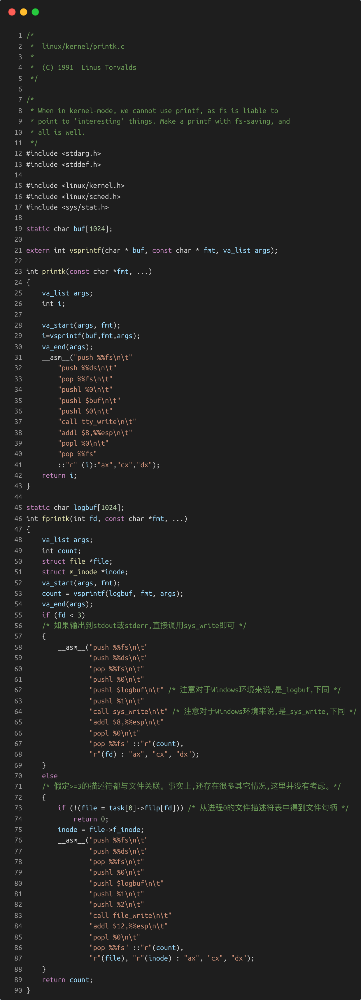 

fprintk函数是我们自己加的。

### 1.5 状态切换点

fprintk函数都是我们新加的。

#### 1.5.1 修改linux-0.11/kernel/exit.c

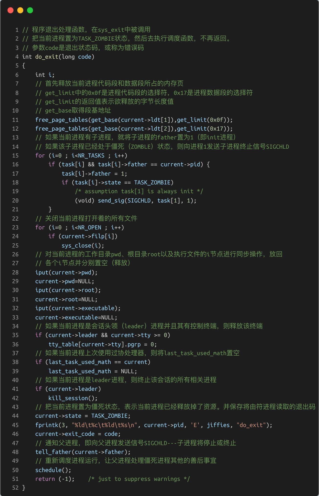 

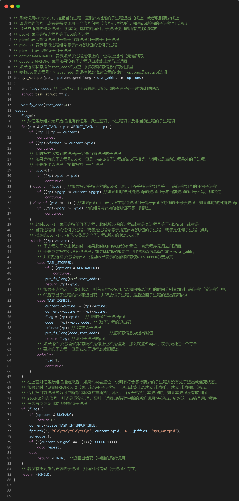 

#### 1.5.2 修改linux-0.11/kernel/fork.c

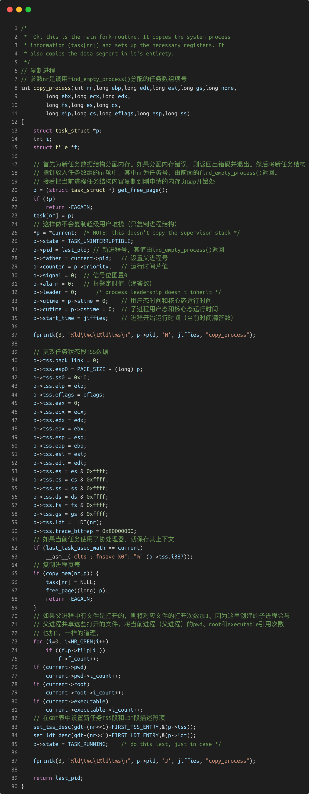 

#### 1.5.3 修改linux-0.11/kernel/sched.c

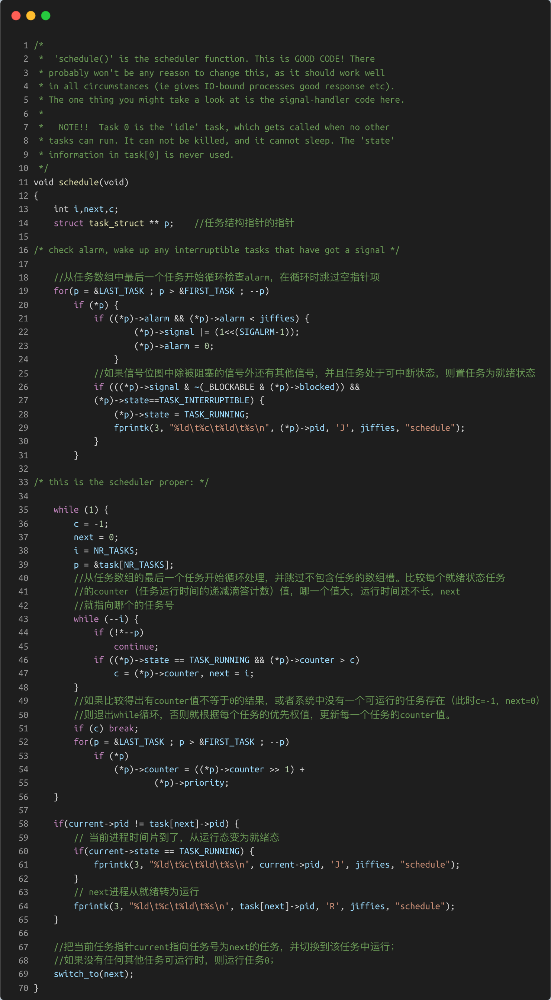 

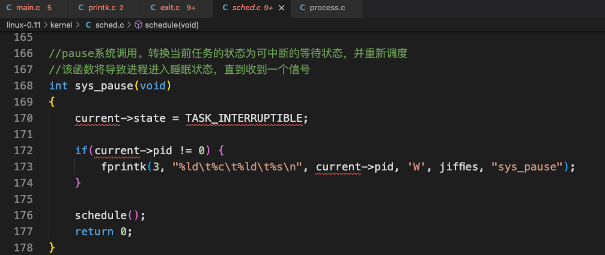 

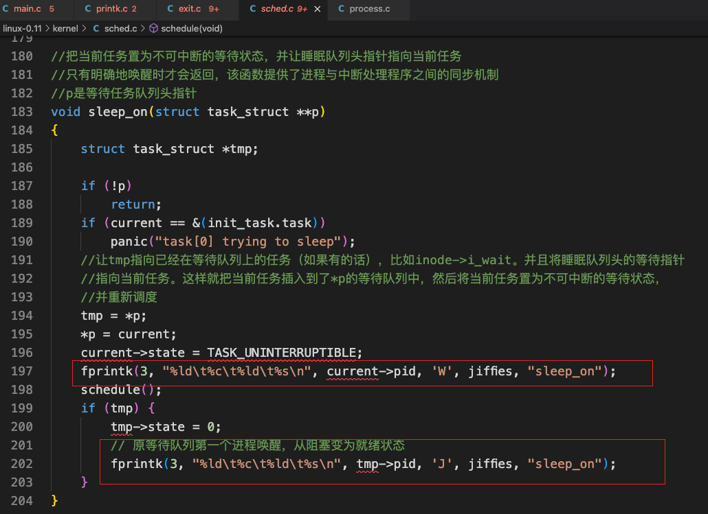 

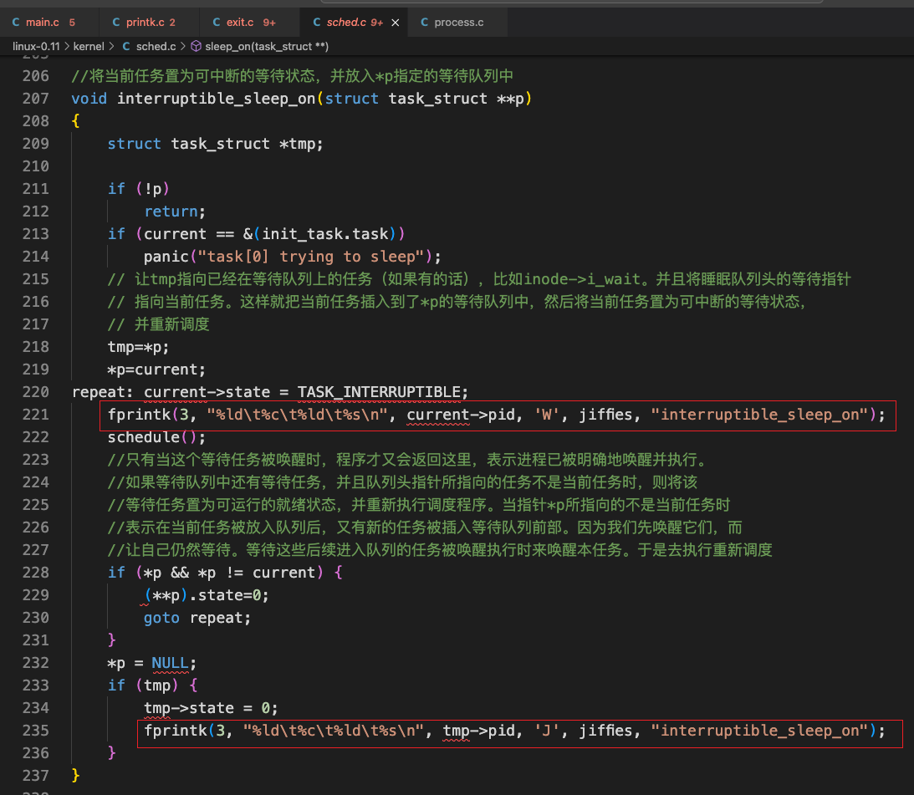 

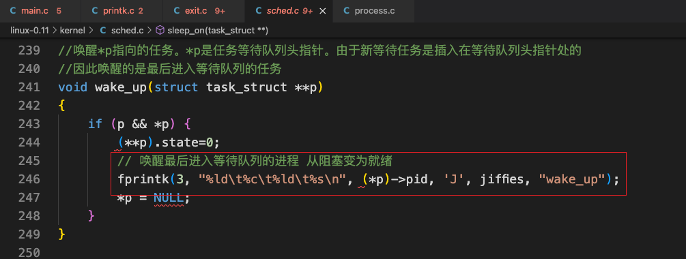 

## 2. 结果分析

+ 将`test/test_process_state/process.c`拷贝到`./hdc/usr/root`中；

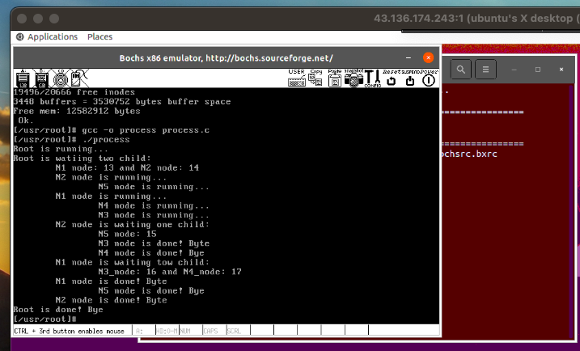 

生成的日志文件在`./hdc/var/process.log`。我们把它拷出来放在目录：`test/test_process_state/`

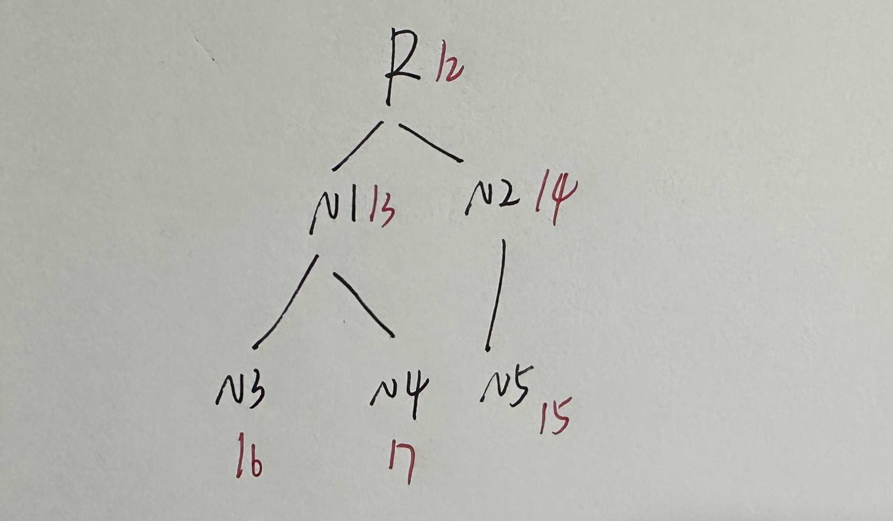 

```c
1	N	48	copy_process    //建立进程1
1	J	48	copy_process    //进程1建立后就进入就绪队列
0	J	48	schedule        //进程0从运行变为就绪 让出CPU
1	R	48	schedule        //进程1得到CPU 开始运行

2	N	49	copy_process    //进程1创建进程2 进程2会运行/etc/rc脚本 然后退出
2	J	49	copy_process    //进程2进入就绪队列
1	W	49	sys_waitpid     //进程1等待进程2退出
2	R	49	schedule        //进程2开始运行

3	N	64	copy_process     //进程2创建进程3 进程3是/bin/sh建立的运行脚本的子进程
3	J	64	copy_process     //进程3进入就绪队列

2	E	68	do_exit         //进程2不等进程3退出 先走一步退出
1	J	68	schedule        //进程1此前在等待进程2退出 此时进程2退出了 进程1重新进入就绪队列
1	R	68	schedule        //进程1开始运行

4	N	68	copy_process    //进程1创建进程4 即shell
4	J	69	copy_process    //进程4进入就绪队列
1	W	69	sys_waitpid     //进程1开始等待进程4(shell)退出 除非执行exit命令 否则shell不会退出
3	R	69	schedule        //进程3开始运行

3	W	75	sys_pause       //进程3主动睡觉 让出CPU
4	R	75	schedule        //进程4开始运行

5	N	107	copy_process    //进程5是shell创建的不知道做什么的进程 可能是ls命令
5	J	107	copy_process    //进程5进入就绪队列

4	W	108	sleep_on        //进程4进入不可中断睡眠状态 必须要执行wake_up来唤醒它
5	R	108	schedule        //进程5开始运行

4	J	110	wake_up         //进程5唤醒睡觉的进程4 进程4进入就绪队列
5	E	110	do_exit         //进程5退出
4	R	110	schedule        //进程4开始运行

4	W	116	interruptible_sleep_on  //shell等待用户输入命令 进程4变为可中断阻塞 来了一个信号或者调用wake_up或者schedule可以将它唤醒
0	R	116	schedule        //现在无事可做 让进程0运行

3	J	3074	schedule
3	R	3074	schedule
3	W	3074	sys_pause
0	R	3074	schedule

4	J	7190	wake_up
4	R	7190	schedule
4	W	7190	interruptible_sleep_on
0	R	7190	schedule

4	J	7994	wake_up
4	R	7994	schedule
4	W	7994	interruptible_sleep_on
0	R	7994	schedule

4	J	9707	wake_up
4	R	9707	schedule
4	W	9707	interruptible_sleep_on
0	R	9708	schedule
4	J	10610	wake_up
4	R	10610	schedule
4	W	10611	interruptible_sleep_on
0	R	10611	schedule
4	J	10791	wake_up
4	R	10791	schedule
4	W	10791	interruptible_sleep_on
0	R	10791	schedule
4	J	15074	wake_up
4	R	15075	schedule
4	W	15075	interruptible_sleep_on
0	R	15075	schedule
4	J	16567	wake_up
4	R	16567	schedule
4	W	16567	interruptible_sleep_on
0	R	16567	schedule
4	J	17420	wake_up
4	R	17420	schedule
4	W	17420	interruptible_sleep_on
0	R	17420	schedule
4	J	17614	wake_up
4	R	17614	schedule
4	W	17614	interruptible_sleep_on
0	R	17614	schedule
4	J	17922	wake_up
4	R	17922	schedule
4	W	17922	interruptible_sleep_on
0	R	17922	schedule
4	J	18099	wake_up
4	R	18099	schedule
4	W	18099	interruptible_sleep_on
0	R	18099	schedule
4	J	18107	wake_up
4	R	18107	schedule
4	W	18107	interruptible_sleep_on
0	R	18107	schedule
4	J	18790	wake_up
4	R	18790	schedule
4	W	18791	interruptible_sleep_on
0	R	18791	schedule
4	J	18793	wake_up
4	R	18793	schedule
4	W	18793	interruptible_sleep_on
0	R	18793	schedule
4	J	25657	wake_up
4	R	25657	schedule
4	W	25658	interruptible_sleep_on
0	R	25658	schedule
4	J	29431	wake_up
4	R	29431	schedule
6	N	29433	copy_process
6	J	29434	copy_process
4	J	29434	schedule
6	R	29434	schedule
7	N	29439	copy_process
7	J	29439	copy_process
6	W	29440	sys_waitpid
7	R	29440	schedule
7	J	29470	schedule
4	R	29470	schedule
4	W	29470	sys_waitpid
7	R	29470	schedule
7	E	29500	do_exit
6	J	29500	schedule
6	R	29500	schedule
8	N	29501	copy_process
8	J	29502	copy_process
6	W	29502	sys_waitpid
8	R	29502	schedule
8	E	29636	do_exit
6	J	29636	schedule
6	R	29636	schedule
9	N	29636	copy_process
9	J	29637	copy_process
6	W	29637	sys_waitpid
9	R	29637	schedule
9	E	29682	do_exit
6	J	29682	schedule
6	R	29682	schedule
10	N	29684	copy_process
10	J	29685	copy_process
6	W	29685	sys_waitpid
10	R	29685	schedule
10	E	29765	do_exit
6	J	29766	schedule
6	R	29766	schedule
6	E	29768	do_exit
4	J	29768	schedule
4	R	29768	schedule
11	N	29768	copy_process
11	J	29769	copy_process
4	W	29769	sleep_on
11	R	29769	schedule
4	J	29771	wake_up
11	E	29772	do_exit
4	R	29772	schedule
4	W	29772	interruptible_sleep_on
0	R	29773	schedule
4	J	31660	wake_up
4	R	31660	schedule
4	W	31660	interruptible_sleep_on
0	R	31660	schedule
4	J	32611	wake_up
4	R	32611	schedule
4	W	32611	interruptible_sleep_on
0	R	32611	schedule
4	J	32731	wake_up
4	R	32731	schedule
4	W	32731	interruptible_sleep_on
0	R	32731	schedule
4	J	32741	wake_up
4	R	32741	schedule
4	W	32741	interruptible_sleep_on
0	R	32741	schedule
4	J	32976	wake_up
4	R	32976	schedule
4	W	32976	interruptible_sleep_on
0	R	32976	schedule
4	J	33038	wake_up
4	R	33038	schedule
4	W	33038	interruptible_sleep_on
0	R	33038	schedule
4	J	33563	wake_up
4	R	33564	schedule
4	W	33564	interruptible_sleep_on
0	R	33564	schedule
4	J	33566	wake_up
4	R	33566	schedule
4	W	33566	interruptible_sleep_on
0	R	33566	schedule
4	J	34242	wake_up
4	R	34242	schedule
4	W	34242	interruptible_sleep_on
0	R	34243	schedule

//main函数开始
4	J	36577	wake_up
4	R	36577	schedule

12	N	36578	copy_process    //创建进程12    root=12
12	J	36578	copy_process    //进程12进入就绪队列
4	W	36579	sys_waitpid     //进程4等待进程12退出

12	R	36579	schedule        //进程12运行
13	N	36580	copy_process    //进程12创建进程13 n1_pid=13
13	J	36580	copy_process
14	N	36581	copy_process    //进程12创建进程14 n2_pid=14
14	J	36582	copy_process
12	W	36582	sys_waitpid     //进程12阻塞 等待进程13和14退出

14	R	36582	schedule        //进程14运行
15	N	36582	copy_process    //进程14创建进程15 n5_pid=15 进程15是进程14的子进程
15	J	36583	copy_process
14	W	36583	sys_pause       //进程14阻塞

15	R	36583	schedule        //进程15运行
15	J	36598	schedule        //运行一段时间后 进程15的时间片变为0 此时进程15变为就绪 进入就绪队列 等待下次给它分配时间片

13	R	36598	schedule        //进程13得到时间片 开始运行
16	N	36598	copy_process    //进程13创建子进程16 n3_pid=16
16	J	36598	copy_process
17	N	36599	copy_process    //进程13创建子进程17 n4_pid=17
17	J	36599	copy_process

13	J	36613	schedule        //进程13的时间片用完了 进入就绪队列等待重新分配时间片
17	R	36613	schedule        //进程17开始运行

17	J	36628	schedule        //进程17的时间片用完了 进入就绪队列等待重新分配时间片
16	R	36628	schedule        //进程16开始运行

16	J	36643	schedule
17	R	36643	schedule
17	J	36658	schedule
16	R	36658	schedule
16	J	36673	schedule
15	R	36673	schedule
14	J	36688	schedule
15	J	36688	schedule
14	R	36688	schedule
14	W	36688	sys_pause
13	R	36688	schedule
13	J	36703	schedule
17	R	36703	schedule
17	J	36718	schedule
16	R	36718	schedule
16	J	36733	schedule
15	R	36733	schedule
15	J	36748	schedule
13	R	36748	schedule
13	J	36763	schedule
17	R	36763	schedule
17	J	36778	schedule
16	R	36778	schedule
14	J	36793	schedule
16	J	36793	schedule
14	R	36793	schedule
14	W	36793	sys_pause
15	R	36793	schedule
15	J	36808	schedule
13	R	36808	schedule
13	J	36823	schedule
17	R	36823	schedule
17	J	36838	schedule
16	R	36838	schedule
16	J	36853	schedule
15	R	36853	schedule
15	J	36868	schedule
13	R	36868	schedule
13	J	36883	schedule
17	R	36883	schedule
14	J	36898	schedule
17	J	36898	schedule
14	R	36898	schedule
14	W	36898	sys_pause
16	R	36898	schedule
16	J	36913	schedule
15	R	36913	schedule
15	J	36928	schedule
13	R	36928	schedule
13	J	36943	schedule
17	R	36943	schedule
17	J	36958	schedule
16	R	36958	schedule
16	J	36973	schedule
15	R	36973	schedule
15	J	36988	schedule
13	R	36988	schedule
14	J	37003	schedule
13	J	37003	schedule
14	R	37003	schedule
14	W	37003	sys_pause
17	R	37003	schedule
17	J	37018	schedule
16	R	37018	schedule
16	J	37033	schedule
15	R	37033	schedule
15	J	37048	schedule
13	R	37048	schedule
13	J	37063	schedule
17	R	37063	schedule
17	J	37078	schedule
16	R	37078	schedule
16	J	37093	schedule
15	R	37093	schedule
14	J	37108	schedule
15	J	37108	schedule
14	R	37108	schedule
14	W	37108	sys_pause
13	R	37108	schedule
13	J	37123	schedule
17	R	37123	schedule
17	J	37138	schedule
16	R	37138	schedule
16	J	37153	schedule
15	R	37153	schedule
15	J	37168	schedule
13	R	37168	schedule
13	J	37183	schedule
17	R	37183	schedule
17	J	37198	schedule
16	R	37198	schedule
14	J	37213	schedule
16	J	37213	schedule
14	R	37213	schedule
14	W	37213	sys_pause
15	R	37213	schedule
15	J	37228	schedule
13	R	37228	schedule
13	J	37243	schedule
17	R	37243	schedule
17	J	37258	schedule
16	R	37258	schedule
16	J	37273	schedule
15	R	37273	schedule
15	J	37288	schedule
13	R	37288	schedule
13	J	37303	schedule
17	R	37303	schedule
14	J	37318	schedule
17	J	37318	schedule
14	R	37318	schedule
14	W	37318	sys_pause
16	R	37318	schedule
16	J	37333	schedule
15	R	37333	schedule
15	J	37348	schedule
13	R	37348	schedule
13	J	37363	schedule
17	R	37363	schedule
17	J	37378	schedule
16	R	37378	schedule
16	J	37393	schedule
15	R	37393	schedule
15	J	37408	schedule
13	R	37408	schedule
14	J	37423	schedule
13	J	37423	schedule
14	R	37423	schedule
14	W	37423	sys_pause
17	R	37423	schedule
17	J	37438	schedule
16	R	37438	schedule
16	J	37453	schedule
15	R	37453	schedule
15	J	37468	schedule
13	R	37468	schedule
13	J	37483	schedule
17	R	37483	schedule
17	J	37498	schedule
16	R	37498	schedule
16	J	37513	schedule
15	R	37513	schedule
14	J	37528	schedule
15	J	37528	schedule
14	R	37528	schedule
14	W	37528	sys_pause
13	R	37528	schedule
13	J	37543	schedule
17	R	37543	schedule
17	J	37558	schedule
16	R	37558	schedule
16	J	37573	schedule
15	R	37573	schedule
15	J	37588	schedule
13	R	37588	schedule
13	J	37603	schedule
17	R	37603	schedule
17	J	37618	schedule
16	R	37618	schedule
14	J	37633	schedule
16	J	37633	schedule
14	R	37633	schedule
14	W	37633	sys_waitpid
15	R	37633	schedule
15	J	37648	schedule
13	R	37648	schedule
13	J	37663	schedule
17	R	37663	schedule
17	J	37678	schedule
16	R	37678	schedule
16	J	37693	schedule
15	R	37693	schedule
15	J	37708	schedule
13	R	37708	schedule
13	J	37723	schedule
17	R	37723	schedule
17	J	37738	schedule
16	R	37738	schedule
16	J	37753	schedule
15	R	37753	schedule
15	J	37768	schedule
13	R	37768	schedule
13	J	37783	schedule
17	R	37783	schedule
17	J	37798	schedule
16	R	37798	schedule
16	W	37798	sys_pause
15	R	37798	schedule
15	J	37813	schedule
13	R	37813	schedule
13	J	37828	schedule
17	R	37828	schedule
17	J	37843	schedule
15	R	37843	schedule
15	J	37858	schedule
13	R	37858	schedule
13	J	37873	schedule
17	R	37873	schedule
17	J	37888	schedule
15	R	37888	schedule
16	J	37903	schedule
15	J	37903	schedule
16	R	37903	schedule
16	W	37903	sys_pause
13	R	37903	schedule
13	J	37918	schedule
17	R	37918	schedule
17	J	37933	schedule
15	R	37933	schedule
15	J	37948	schedule
13	R	37948	schedule
13	J	37963	schedule
17	R	37963	schedule
17	J	37978	schedule
15	R	37978	schedule
15	J	37993	schedule
13	R	37993	schedule
16	J	38008	schedule
13	J	38008	schedule
16	R	38008	schedule
16	W	38008	sys_pause
17	R	38008	schedule
17	J	38023	schedule
15	R	38023	schedule
15	J	38038	schedule
13	R	38038	schedule
13	J	38053	schedule
17	R	38053	schedule
17	W	38063	sys_pause
15	R	38063	schedule
15	J	38078	schedule
13	R	38078	schedule
13	J	38093	schedule
15	R	38093	schedule
15	J	38108	schedule
13	R	38108	schedule
16	J	38123	schedule
13	J	38123	schedule
16	R	38123	schedule
16	W	38123	sys_pause
15	R	38123	schedule
15	J	38138	schedule
13	R	38138	schedule
13	J	38153	schedule
15	R	38153	schedule
17	J	38168	schedule
15	J	38168	schedule
17	R	38168	schedule
17	W	38168	sys_pause
13	R	38168	schedule
13	J	38183	schedule
15	R	38183	schedule
15	J	38198	schedule
13	R	38198	schedule
13	J	38213	schedule
15	R	38213	schedule
16	J	38228	schedule
15	J	38228	schedule
16	R	38228	schedule
16	W	38228	sys_pause
13	R	38228	schedule
13	J	38243	schedule
15	R	38243	schedule
15	J	38258	schedule
13	R	38258	schedule
17	J	38273	schedule
13	J	38273	schedule
17	R	38273	schedule
17	W	38273	sys_pause
15	R	38273	schedule
15	W	38278	sys_pause
13	R	38278	schedule
16	J	38338	schedule
13	J	38338	schedule
16	R	38338	schedule
16	W	38338	sys_pause
13	R	38338	schedule
17	J	38383	schedule
15	J	38383	schedule
13	J	38383	schedule
17	R	38383	schedule
17	W	38383	sys_pause
15	R	38383	schedule
15	W	38383	sys_pause
13	R	38383	schedule
16	J	38443	schedule
13	J	38443	schedule
16	R	38443	schedule
16	W	38443	sys_pause
13	R	38443	schedule
17	J	38488	schedule
15	J	38488	schedule
13	J	38488	schedule
17	R	38488	schedule
17	W	38488	sys_pause
15	R	38488	schedule
15	W	38488	sys_pause
13	R	38488	schedule
16	J	38548	schedule
13	J	38548	schedule
16	R	38548	schedule

16	E	38548	do_exit     //进程16结束 退出
13	R	38548	schedule    //进程13运行 进程13是进程16的父亲 之前在等待16退出 现在16退出了 它就可以重新运行了
17	J	38593	schedule
15	J	38593	schedule
13	J	38593	schedule
17	R	38593	schedule
17	W	38593	sys_pause
15	R	38593	schedule
15	W	38593	sys_pause
13	R	38593	schedule
17	J	38698	schedule
15	J	38698	schedule
13	J	38698	schedule
17	R	38698	schedule
17	E	38698	do_exit     //进程17退出
15	R	38698	schedule
15	W	38698	sys_pause
13	R	38698	schedule
13	E	38784	do_exit     //进程13退出
12	J	38784	schedule
12	R	38784	schedule
12	W	38784	sys_waitpid
0	R	38784	schedule
15	J	38799	schedule
15	R	38799	schedule
15	E	38799	do_exit     //进程15退出
14	J	38799	schedule
14	R	38799	schedule
14	E	38800	do_exit     //进程14退出
12	J	38800	schedule
12	R	38800	schedule
12	E	38800	do_exit     //进程12退出
4	J	38800	schedule    //进程4之前一直在等待进程12退出 现在进程12退出了 进程14进入就绪队列
4	R	38800	schedule    //进程4运行
18	N	38801	copy_process
18	J	38801	copy_process
4	W	38802	sleep_on
18	R	38802	schedule
4	J	38804	wake_up
18	E	38804	do_exit
4	R	38805	schedule
4	W	38805	interruptible_sleep_on
0	R	38805	schedule
4	J	70509	wake_up
4	R	70510	schedule
4	W	70510	interruptible_sleep_on
0	R	70510	schedule
4	J	70741	wake_up
4	R	70741	schedule
4	W	70741	interruptible_sleep_on
0	R	70741	schedule
4	J	72802	wake_up
4	R	72802	schedule
19	N	72804	copy_process
19	J	72804	copy_process
4	W	72805	sys_waitpid
19	R	72805	schedule

```

